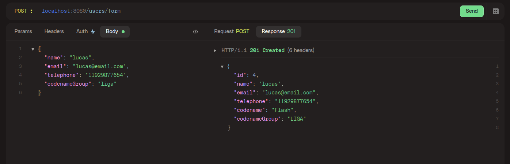
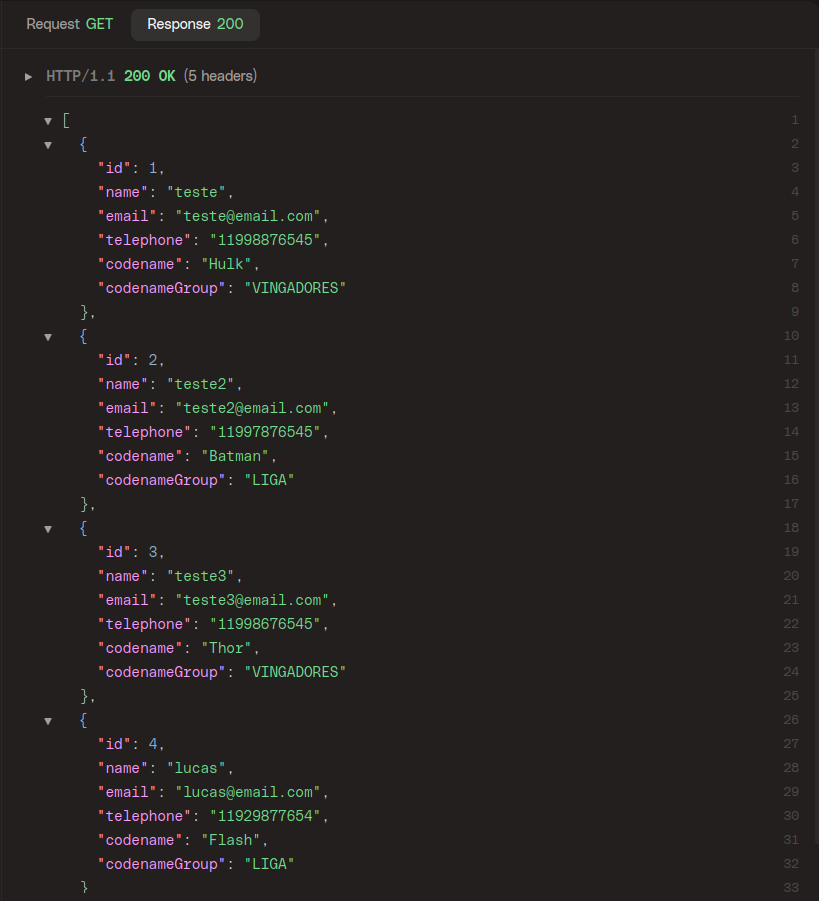
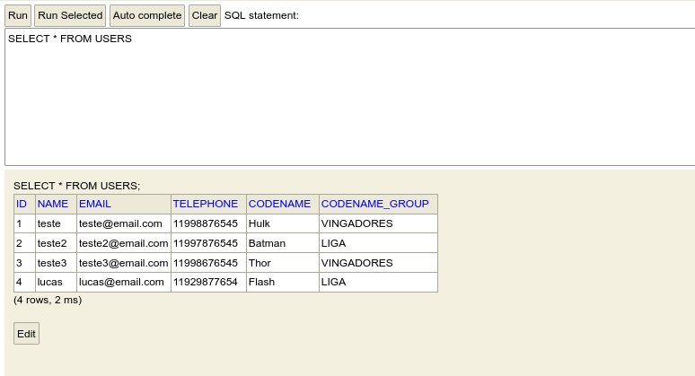

# Uol Host teste back-end
API Rest - proposta de teste back-end do Uol Host.  
Desenvolvido para meus estudos em Java e Spring Framework

> "O teste consiste em montar uma aplicação Java capaz de recuperar informações de um arquivo XML e de um arquivo JSON, persistir um cadastro em um banco de dados em memória ou em arquivo e listar os cadastros em uma interface simples."  

[Repositorio do teste](https://github.com/uolhost/test-backEnd-Java)  
Repositório do [front](https://github.com/lucasvir/uolhost-spa)

Projeto inclui:
- Leitura e processamento de dados que estão em arquivos JSON e XML via URL externa.
- Persistencia em banco de dados em memória (H2). 
- Listar todos os usuário incluindo os codinomes escolhidos randomicamente dos arquivos, bem como de que lista o codinome pertence.

  Mais detalhes da [proposta](https://github.com/uolhost/test-backEnd-Java).

## Techs:
  - Java 17
  - Spring Framework
  - JPA/Hibernate
  - JUnit
  - H2 Database
  - Maven
    

## 

### POST - /users/form
Criando usuário

### GET - /users
Listando todos usuários

### DB - SELECT * users
DB com os dados persistidos

